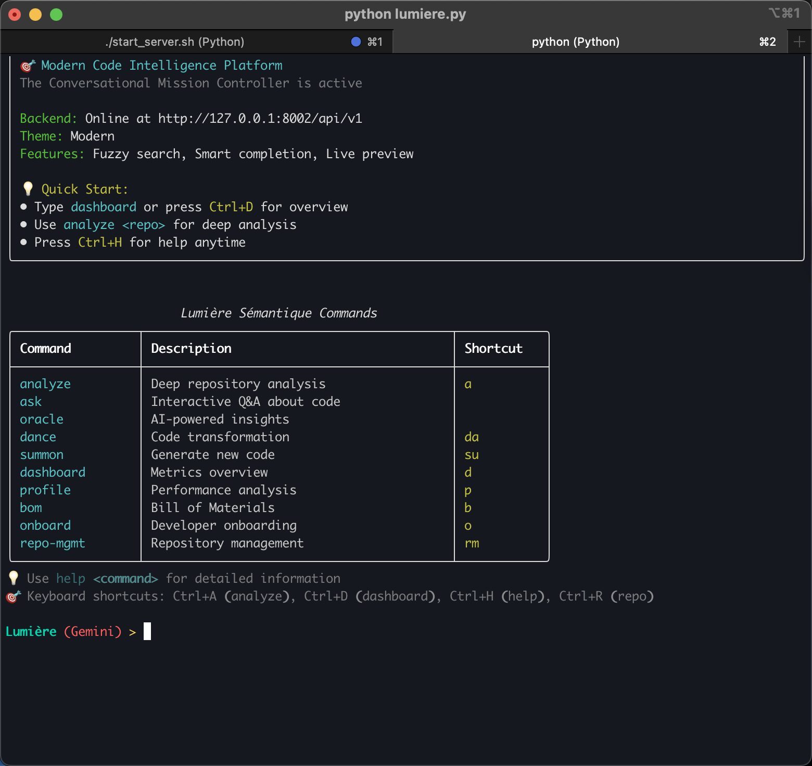

# Lumière Sémantique

**Creator:** Oriel Silva Jr | [LatchyCat](https://github.com/latchycat)

**Lumière Sémantique** is a sophisticated, AI-powered software development assistant designed to illuminate the complexities of your codebase. It combines the power of Large Language Models (LLMs) with advanced code analysis techniques to provide deep insights, automate tedious tasks, and accelerate your development workflow.



## Core Features

Lumière Sémantique is more than just a code analysis tool; it's a comprehensive suite of services designed to assist developers at every stage of the development lifecycle.

### Analysis & Insight
- **Strategist:** Prioritizes issues based on impact and complexity.
- **Cartographer:** Generates interactive architectural graphs of your codebase.
- **Oracle:** Answers architectural questions about your code.
- **BOM (Bill of Materials):** Provides a detailed breakdown of your project's dependencies, services, and security vulnerabilities.
- **Loremaster:** Creates and manages a knowledge base for your project.

### Automation & Generation
- **Summoner:** Generates new code components and features based on your specifications.
- **Mage:** Performs magical code transformations and refactoring.
- **Crucible:** Validates code changes in a sandboxed environment.
- **Ambassador:** Automates the creation of pull requests.

### Onboarding & Collaboration
- **Onboarding Concierge:** Helps new developers get up to speed quickly by suggesting good first issues and finding experts.
- **Diplomat:** Finds similar issues to prevent duplicate work.
- **Review Service:** Adjudicates and harmonizes pull requests.

### And More...
- **Quartermaster:** Manages resources and dependencies.
- **Sentinel:** Monitors repository health and metrics.
- **Profile Service:** Analyzes and suggests improvements for developer profiles.

## Getting Started

### Prerequisites
- Python 3.8+
- Django
- Other dependencies listed in `backend/requirements.txt`

### Installation
1. Clone the repository:
   ```bash
   git clone https://github.com/LatchyCat/lumiere-semantique.git
   cd lumiere-semantique
   ```
2. Install the required dependencies:
   ```bash
   pip install -r backend/requirements.txt
   ```

### Running the Django Server
The backend server provides the core API for the CLI and future web interface.

To start the Django server, run the following command from the project root:
```bash
./start_server.sh
```
This will start the development server on `http://127.0.0.1:8002/`.

### Using the CLI
The Lumière Sémantique CLI is your primary interface for interacting with the various services.

To start the CLI, run the following command from the project root:
```bash
python lumiere.py
```
This will launch the interactive CLI, where you can access all of Lumière Sémantique's features.

## Next Steps

The next major milestone for Lumière Sémantique is the development of a modern, intuitive frontend using **Vite + React**. This will provide a rich, graphical interface for visualizing data, interacting with the various services, and making the power of Lumière Sémantique even more accessible.

Stay tuned for updates!

## API Endpoints (for direct testing)

You can interact directly with the Lumière Sémantique backend API using `curl`. Ensure the Django server is running (`./start_server.sh`) before attempting these calls. The base URL for the API is `http://127.0.0.1:8002/api/v1`.

### 1. List Available LLM Models
*   **Description:** Retrieves a list of all LLM models configured and available for use by the system.
*   **Endpoint:** `/models/list/` (GET)
```bash
curl -X GET http://127.0.0.1:8002/api/v1/models/list/
```

### 2. Ingest a GitHub Repository
*   **Description:** Initiates the ingestion process for a specified GitHub repository. This clones the repository and prepares it for analysis.
*   **Endpoint:** `/ingest/` (POST)
*   **Note:** Replace `YOUR_GITHUB_REPO_URL` with an actual GitHub repository URL (e.g., `https://github.com/octocat/Spoon-Knife`).
```bash
curl -X POST http://127.0.0.1:8002/api/v1/ingest/ \
     -H "Content-Type: application/json" \
     -d '{"repo_url": "YOUR_GITHUB_REPO_URL"}'
```

### 3. Ask The Oracle a Question
*   **Description:** Queries the Oracle service for insights or answers about an already ingested repository.
*   **Endpoint:** `/oracle/ask/` (POST)
*   **Note:** Replace `YOUR_REPO_ID` (e.g., `octocat_Spoon-Knife`) and `YOUR_QUESTION` with relevant values. The `repo_id` is typically the GitHub user/repo name with `/` replaced by `_`.
```bash
curl -X POST http://127.0.0.1:8002/api/v1/oracle/ask/ \
     -H "Content-Type: application/json" \
     -d '{"repo_id": "YOUR_REPO_ID", "question": "YOUR_QUESTION"}'
```

### 4. List Analyzed Repositories
*   **Description:** Fetches a list of all repositories that have been successfully ingested and analyzed by Lumière Sémantique.
*   **Endpoint:** `/repositories/` (GET)
```bash
curl -X GET http://127.0.0.1:8002/api/v1/repositories/
```

### 5. Get Bill of Materials (BOM) Data
*   **Description:** Retrieves a summary of the Bill of Materials for a specified repository, including dependencies, services, and security overview.
*   **Endpoint:** `/bom/` (GET)
*   **Note:** Replace `YOUR_REPO_ID` with an actual ingested repository ID.
```bash
curl -X GET "http://127.0.0.1:8002/api/v1/bom/?repo_id=YOUR_REPO_ID&format=summary"
```
